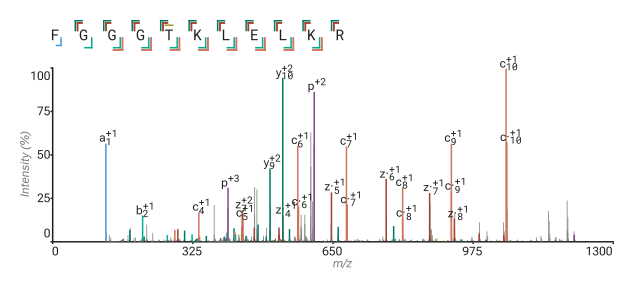
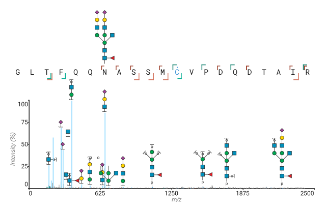

# Annotator

A simple tool to help you manually discover the depths of your (complex) spectra, one spectrum at a time. Load your rawfiles, select a spectrum and add your annotation with full control over theoretical fragments. Use the interactive spectrum to discover what your spectrum means and to export gorgeous images.

<picture>
    <source media="(prefers-color-scheme: dark)" srcset="images/1_dark.svg">
    
</picture>

It can even make nice pictures from glycans as seen below. 

<picture>
    <source media="(prefers-color-scheme: dark)" srcset="images/2_dark.svg">
    
</picture>

## Features

> [!TIP]
> Do you have some very complex feature in your spectra? It is extremely likely the Annotator can annotate it.

* Open raw files (mgf, mzML, Thermo RAW, Bruker .tdf)
* Full ProForma 2.0 support:
    - Complex modifications, from Unimod, PSI-MOD, Resid, and XLMOD, but also masses and formula
    - Ambiguous modifications
    - Cross-linked peptidoforms
    - Chimeric spectra, which includes DIA
    - Glycans, both structures and compositions
* Supports complex and highly customizable fragmentation models
* Supports custom modifications
* Supports loading and searching in 20+ identified peptides file formats
    - Amongst others: msFragger, PEAKS, mzTAB, SSL
* Extensive control over the visualisation
* Export to PDF (do not forget to turn on background graphics in the advanced settings while printing)

[There is also a more comprehensive guide](frontend/assets/Annotator-manual.pdf)

## Peptidoform sequence

It uses the [ProForma 2.0](https://github.com/HUPO-PSI/ProForma) specification to specify the sequence. Here are some examples of valid sequences:

* `VAEINPSNGGTTFNEKFKGGKATJ` Normal aminoacids
* `EM[L-methionine sulfoxide]EVEES[UNIMOD:21]PEK` Modifications using [Unimod](http://www.unimod.org) and [PSI-MOD](https://www.ebi.ac.uk/ols/ontologies/mod)
* `TFNEKF[+15.9949]KGGKATJ` Modifications using raw masses
* `TFNEKF[Formula:O]KGGKATJ` Modifications using elemental formula
* `TFNEKF[Glycan:HexNAc1Hex2]KGGKATJ` Modifications glycan compositions
* `[+16]-TFNEKFKGGKATJ-[Methyl]` Terminal modifications
* `<15N>TFNEKFKGGKATJ` Global isotope modifications (all Nitrogen is 15N)
* `<[S-carboxamidomethyl-L-cysteine]@C>AVYYCSRWGGDGFYAMDYWGQG` Global modifications (all C are carboxamidomethylated)
* `[UNIMOD:374]?TFNEKFCKGGCKATJ` Modifications where the location is unknown
* `TFNEKFC[UNIMOD:374#g1]KGGC[#g1]KATJ` (identical to the one above)
* `TFNEKF(CKGGCK)[UNIMOD:374#g1]ATJ` (identical to the one above)
* `VAEINPSNGGTT+FNEKFKGGKATJ` Multimeric spectra, meaning two separate peptides are in your spectrum at the same time
* `VAEINK[X:DSSO#XL1]SNGGTT//WAK[#XL1]INK` A DSSO cross-link between two lysines on two peptides (note the use of `//` versus `+` to indicate cross-linked peptides)
* `VAEINK[X:DSSO#XL1]SNGGTT` A hydrolysed DSSO cross-linker

## Installing

### Using winget

On windows use:

> [!NOTE]  
> `winget install --id Snijderlab.Annotator`.

### From binary 

See [releases](https://github.com/snijderlab/annotator/releases) for the latest release, here you will also find the prebuilt binaries for your architecture.

### From source

To build from source. Clone the repository. And build with `cargo tauri dev`. Make sure you have installed [Rust](https://www.rust-lang.org/tools/install) and [Tauri](https://tauri.app/) beforehand.

## Thermo RAW files

The .NET 8.0 runtime is needed to open Thermo RAW files. [Which can be downloaded here.](https://dotnet.microsoft.com/en-us/download/dotnet/8.0) Additionally on windows you can use `winget install Microsoft.DotNet.Runtime.8` for a quick install.

## Note on custom modifications and models

Custom modifications can be defined, these allow diagnostic ions and neutral losses to be defined. Additionally custom cross-linkers can be defined to have certain cleavage patterns that can then be searched for in the annotator. The custom modifications are stored in a separate json file on your computer. Updating the Annotator will not remove any previously defined modifications. Additionally copying this file to another computer will copy the whole database to that computer. This can be used to move all your definitions to a new computer when upgrading or to aid a colleague with your definitions.

For custom models much of the same is true. These allow highly advanced fragmentation rules to be set. These models will also not be removed when updating and can be shared and backed up in the same way.