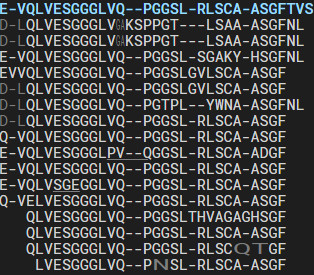

# Mass Alignment
This is an algorithm based on Smith Waterman/Needleman Wunsch for sequence alignment at the aminoacid level, but extended for the use of mass spectrometry. It has some notable features for de novo sequenced
peptides:
* Detects sets of aminoacids of the same mass, even if they differ in length. {Q} matches {AG}
* Detects swaps of aminoacids (up to length 3) {AVG} matches {GAV}
* Handles modifications. {Q} matches {E} but not the other way around (deamidation)

It scales similarly to SW/NW, with N*M. This implementation is quite fast ~118ns * N * M. Below is a preview of an alignment based on this algorithm. The alignment generating code can also be found in this project.

_grey: found isomass, underline: found swap_

## Usage

There is a library `mass_alignment` under `src\lib.rs`. The alignment code can be found under `src\alignment.rs`. The alphabet (lookup matrix) generation under `src\alphabet.rs`. And the HTML generation under `src\template.html`+`src\bin.rs`.

There is a binary to generate the above preview in `src\bin.rs`. You can use this with `cargo run` this generates `test.html` in the root folder.

## Building

[Use cargo](https://www.rust-lang.org/tools/install)

Commands:
* `cargo run` runs `bin.rs`
* `cargo doc --open` builds the documentation
* `cargo test` runs the unit tests
* `cargo bench` runs the benchmarks (will be saved in `target/benchmark_result.csv`)